<!-- ════════════════════════  HEADER  ════════════════════════ -->

  

 

<!-- ════════════════════════  ABOUT  ════════════════════════ -->
## 👋 About / Про мене

<table>
<tr>
<td width="50%" valign="top">

**🇬🇧 English**

- 📈 **Senior Growth Operations Manager** — I run growth & operations day-to-day.
- 🛠️ When I need a tool, I **build it myself** — solo, idea to release.
- 🤖 **Product skills + Claude Code** let me ship real products without a team.
- ⚙️ Working stack: **TypeScript · Next.js · Python · Supabase · BigQuery**.
- 💬 Ask me about **growth ops, solo-building with AI, Next.js + Supabase**.

</td>
<td width="50%" valign="top">

**🇺🇦 Українська**

- 📈 **Senior Growth Operations Manager** — щодня веду growth та операційку.
- 🛠️ Коли потрібен інструмент — **будую його сам**, від ідеї до релізу.
- 🤖 **Продуктові скіли + Claude Code** дають змогу випускати продукти без команди.
- ⚙️ Робочий стек: **TypeScript · Next.js · Python · Supabase · BigQuery**.
- 💬 Питай про **growth ops, соло-розробку з AI, Next.js + Supabase**.

</td>
</tr>
</table>

<!-- ════════════════════════  STACK  ════════════════════════ -->
## 🛠️ Tech Stack

  

  

<!-- ════════════════════════  PROJECTS  ════════════════════════ -->
## 🚀 Projects

Products I built solo — growth & ops needs turned into shipped software.

| | Project | What it does | Stack |
|:--:|---|---|---|
| 🌐 | **[ai-product-sprint](https://github.com/eduardhorkusha-code/ai-product-sprint)** | Knowledge base + AI agents + a modular builder to assemble a mobile product in a 4-hour sprint. | Expo · Supabase |
| 🌐 | **[ai-planner](https://github.com/eduardhorkusha-code/ai-planner)** | LLM-assisted planning experiments. | TypeScript |
| 🔒 | **ai-team** | Multi-agent autonomous engineering team (PM · Dev · QA · Security) on Claude Code. | Python · Claude |
| 🔒 | **Midas** | Brand-reputation intelligence platform — multi-source signals into scores & dashboards. | Next.js · BigQuery · Redis |
| 🔒 | **skelar-events** | Internal events, RSVP & calendar platform. | Next.js · TypeScript |
| 🔒 | **skelar-vault** | Internal hub — events, role-based access control & talent-acquisition tooling. | Next.js · Supabase |
| 🔒 | **printforge-crm** | AI-native CRM for makers — orders, clients, production queue, margin. | Next.js · Supabase |

🌐 open source &nbsp;·&nbsp; 🔒 private (problem space only — no internal details)

<!-- ════════════════════════  CONNECT  ════════════════════════ -->
## 🤝 Connect

  

